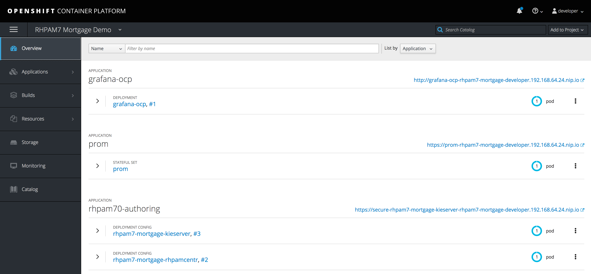
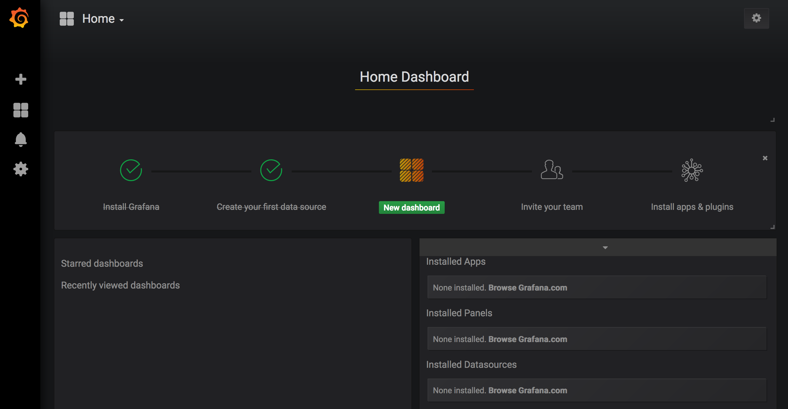
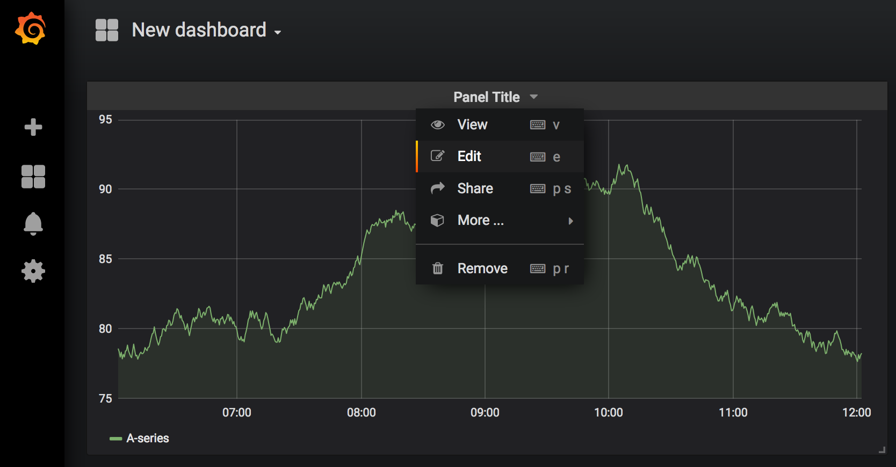
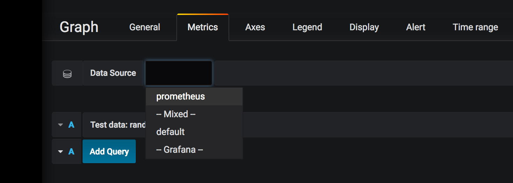
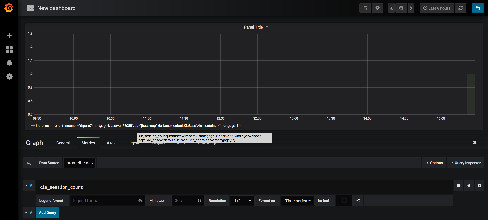
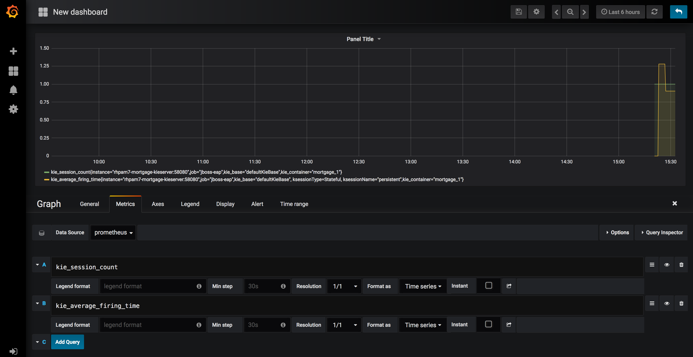

Red Hat Process Automation Manager 7 Demo - OpenShift Monitorin Add-On
=======================================
Project to add [Prometheus](https://prometheus.io) and [Grafana](https://grafana.com) monitoring to an existing Red Hat Process Automation Manager 7 demo installation on OpenShift

This project requires an existing RH PAM 7 demo (e.g. the [RH PAM 7 Install Demo](https://github.com/jbossdemocentral/rhpam7-install-demo) or the [RH PAM 7 Mortgage Demo](https://github.com/jbossdemocentral/rhpam7-mortgage-demo)) installed on OpenShift

---
**NOTE**

This add-on requires an OpenShift version 3.10 or higher. This is due to the fact that the Prometheus JMX Exporter Java Agent JAR is copied as a binary file to a ConfigMap. Binary files in ConfigMaps are supported in OpenShift 3.10+

---

Installation Instructions
----------------------------------
1. Install a RH PAM 7 Demo on OpenShift

2. [Download and unzip](https://github.com/jbossdemocentral/rhpam7-monitoring-addon/archive/master.zip) or [clone this repo](https://github.com/jbossdemocentral/rhpam7-monitoring-addon.git).

3. Make sure that your `oc` client is connected to the OpenShift instance on which you installed your RH PAM 7 demo. Make sure that the current '`oc` project of the logged-in user is the project in which you want to install this monitoring component (this can be verified using the command `oc project`).

3. Run `init-openshift.sh -d {demo-name}` (Linux/macOS, Windows support will be added later), where `{demo-name}` is the name of the demo to which you want to add monitoring. For example `rhpam7-install` for the Install Demo and `rhpam7-mortgage` for the Mortgage Demo. (the demo name is used to patch the correct RHPAM KIE-Server deployments to enable Prometheus monitoring).

The installation script:
* Patches the KIE-Server deployment, enabling Prometheus JMX scraping on port 58080. The script:
  * installs the required Prometheus JMX Exporter Java Agent JAR (in a ConfigMap).
  * copies the JMX Exporter configuration file to an OpenShift ConfigMap.
  * configures the KIE-Server JAVA_OPTS to enable the KIE MBeans and Prometheus JMX Exporter.
  * opens port 58080 on the KIE-Server container image and service.
* Installs Prometheus and:
  * configures it to scrape data from the KIE-Server instance.
  * enables Bearer token authentication on the OpenShift OAuth proxy to enable communication between Grafana and Prometheus.
* Installs Grafana and:
  * creates the Prometheus datasource, configured to use Bearer token authentication.

After the installation, the environment *Overview* in OpenShift will look like this:

Using the Monitoring Add-On
-----------------------------------------
This demo installs a Prometheus and Grafana environment that has been completely pre-configured to monitor the KIE-Servers in the given project. However, the dashboards in Grafana still need to be created.

1. Install a KJAR (Deployment Unit of the pre-installed demo) onto the KIE-Server. Please refer to the documentation of the given demo for instructions. A KJAR needs to be installed onto the KIE-Server to start the KIE MBeans, and thus make them visible in Grafana.

2. Open the Grafana UI by, in the OpenShift console, clicking the `http` route of the "grafana-ocp" application in the OpenShift *Overview* page. The Grafana UI shows that Grafana has been installed, a datasource has been created (this is the Promethues datasource which has been automatically installed by our installer) and that the user can create his/her first dashboard.

3. Click on "New Dashboard". In the "New Dashboard" page, click on "Graph".

4. To configure the panel, click on the downward pointig arrow next to "Panel Title" and click on "Edit".

5. In the "Metrics" tab, select "prometheus" as the datasource.

6. In the "Query" input field, type `kie_session_count` to visualize the number of KIE Sessions created on the KIE-Server. If Grafana, Prometheus and KIE-Server have been setup correctly, the query should autocomplete when you start typing the name `kie_sesssion_count`.

7. Add another query by clicking on the *Add Query* button. Add antoher metric, for example `kie_average_firing_time`.

Depending on your requirements, you can create the monitoring panels needed for your use-case.

Supporting Articles
-------------------

Released versions
-----------------

